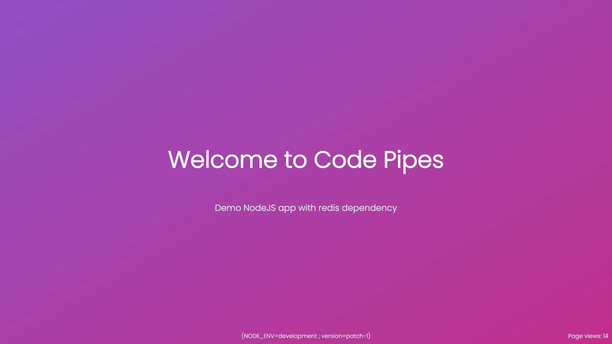

# Demo NodeJS App with typescript

This is a simple NodeJS application that demonstrates how to run a standard app via Buildpack. The application displays a welcome message on a web page, and keeps track of the number of times the page has been viewed on the server.



## Getting Started

To get started with this application, you'll need to have NodeJS installed on your machine.

1. Clone this repository to your local machine.
1. Navigate to the root directory of the repository in your terminal.
1. Run `npm install` to install the required dependencies.
1. Start the server by running `npm start`.
1. Open your web browser and navigate to `http://localhost:3000` to view the web page.

## Configuration

Following environment variables can be configured for the application:

```
NODE_ENV=development
```

## Container image

Container image can be build for this app automatically using buildpack.

```
pack build 01-modejs --builder heroku/builder:22
```