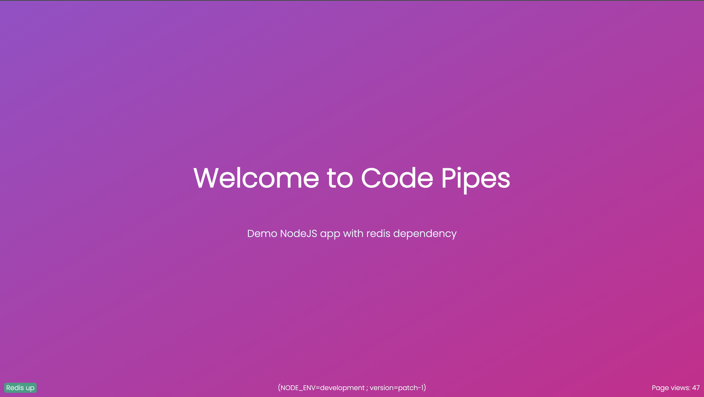

# Demo NodeJS App with Redis Dependency

This is a simple NodeJS application that demonstrates how to use Redis as a dependency. The application displays a welcome message on a web page, and keeps track of the number of times the page has been viewed using Redis.



## Getting Started

To get started with this application, you'll need to have NodeJS and Redis installed on your machine.

1. Clone this repository to your local machine.
1. Navigate to the root directory of the repository in your terminal.
1. Run `npm install` to install the required dependencies.
1. Build typescript code into js `npm run build`.
1. Start a redis server `docker run -p 6379:6379 -it --rm redis`
1. Start the server by running `npm start`.
1. Open your web browser and navigate to `http://localhost:3000` to view the web page.

## Configuration

Following environment variables can be configured for the application:

```
NODE_ENV=development
REDIS_HOST=localhost
REDIS_PORT=6379
REDIS_USER=
REDIS_PASSWORD=
REDIS_DATABASE=
```

## Container image

Container image can be build for this app automatically using buildpack builders from paketo or heroku. Or the Dockerfile can also be used to build directly using docker.

```
# using paketo
# final image size ~270MB
pack build 03-nodejs-redis:paketo --builder paketobuildpacks/builder:base

# OR
# using heroku
# final image size ~910MB
pack build 01-modejs:heroku --builder heroku/builder:22

# OR
# using docker
# final image size ~190MB
docker build -t 03-nodejs-redis .
```

To run the image, use following command:
```
docker run --rm -it -p 3000:3000 03-nodejs-redis
```
